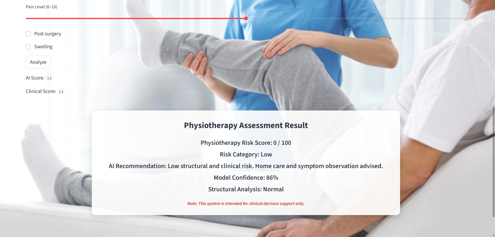
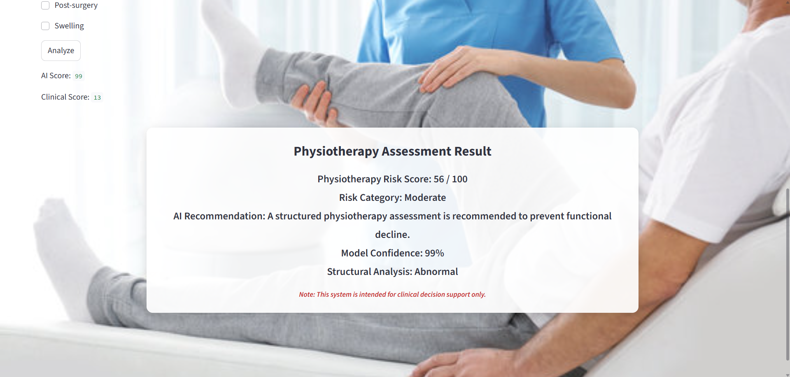

# AI-Assisted Decision Support System for Physiotherapy Requirement

## Overview
The **AI-Assisted Decision Support System for Physiotherapy Requirement** is a deep learning-based application that analyzes X-ray images to assist healthcare professionals in identifying fractures and assessing physiotherapy requirements. The system combines medical image preprocessing, AI-based fracture detection, risk score prediction, and Grad-CAM visualization to provide interpretable and reliable decision support.

> **Note:** This project is intended for educational and research purposes only and should not be used as a substitute for professional medical diagnosis.

---

## Features
- AI-based X-ray image analysis
- Fracture detection using Deep Learning
- CNN, ResNet, and DenseNet models
- Risk score prediction
- Physiotherapy decision support
- Medical image preprocessing
- Grad-CAM visualization for explainable AI
- Model evaluation and testing

---

## Technologies Used

- Python
- TensorFlow
- Keras
- OpenCV
- NumPy
- Matplotlib
- Deep Learning
- Computer Vision

---

## Project Structure

```
 ai_predictor.py
 clean_dataset.py
 cnn_model.py
 evaluate_model.py
 fusion_engine.py
 gradcam.py
 preprocess.py
 risk_score.py
 split_dataset.py
 test_ai.py
 train_densenet.py
 train_resnet.py
 requirements.txt
 README.md
```

---

## Installation

Clone the repository:

```
git clone https://github.com/your-username/your-repository-name.git
```

Install the required dependencies:

```
pip install -r requirements.txt
```

---

##  Run the Project

Execute the prediction module:

```
python ai_predictor.py
```

---
## 📸 Project Results

<table>
<tr>
<td align="center"><b>Normal X-ray Prediction</b></td>
<td align="center"><b>Abnormal X-ray Prediction</b></td>
</tr>

<tr>
<td></td>
<td></td>
</tr>
</table>

## Workflow

1. Load X-ray image
2. Preprocess the image
3. Detect fracture using Deep Learning model
4. Generate physiotherapy risk score
5. Visualize important regions using Grad-CAM
6. Display AI-assisted decision support

---

##  Future Improvements

- Web-based interface using Streamlit or Flask
- Real-time X-ray analysis
- Improved rehabilitation recommendations
- Multi-class bone fracture classification
- Integration with hospital management systems
---

##  License

This project is developed for educational and research purposes.

---

## Author

**Tejaswini Kunamalla**

B.Tech – Computer Science and Engineering
